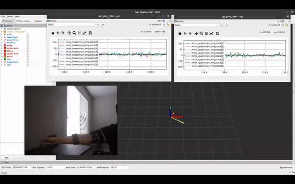
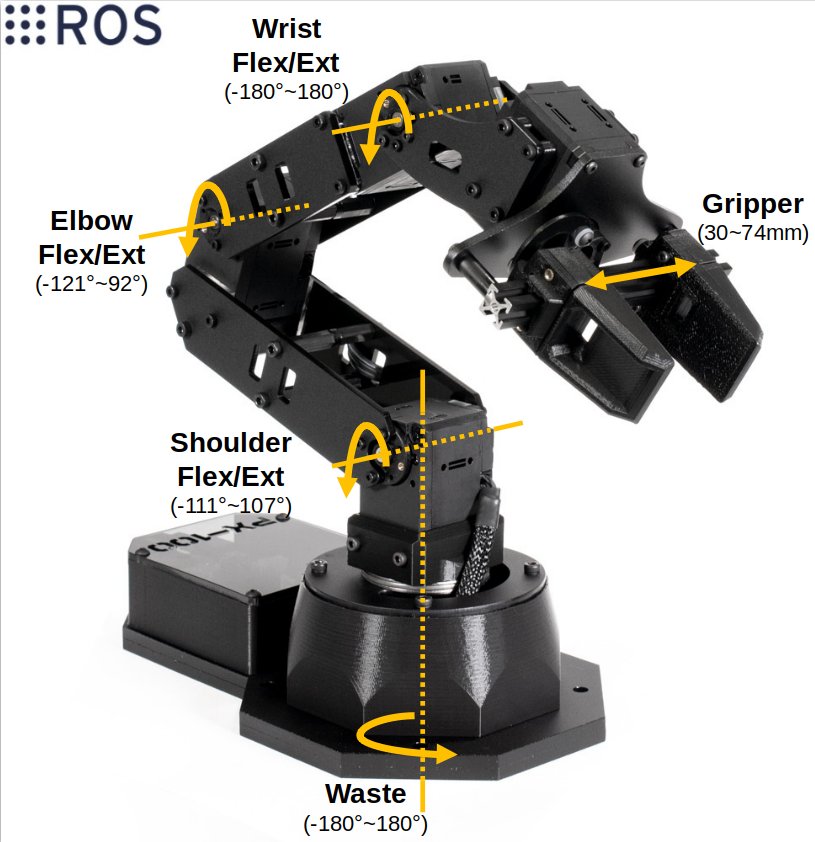
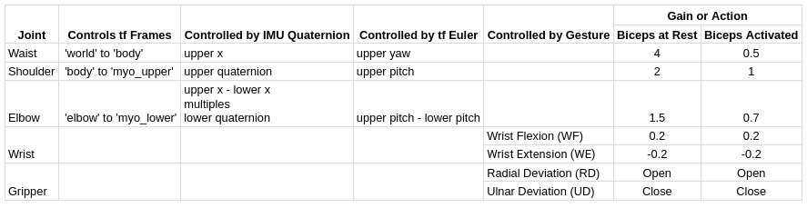

# Use Two Myo to Control PincherX 100
* Sonia Yuxiao Lai
* MSR Final Project  
* [Post](https://aonai.github.io/linked_posts/myo_robot_arm.html)
&nbsp;
* [Related Long-Term EMG Myo project](https://github.com/aonai/long_term_EMG_myo)

## Overview
The goal of this project is to control a PincherX 100 Robot Arm using two Myo armbands. The joints of the robot are controlled through right arm shoulder and elbow. The gripper is controlled through right-hand gestures. Running the project allows a user to grab and place an object that is close by. This project also provides an option to customize robot command frequency so that the user can move the robot at a comfortable speed. 

## Requirements 
* ROS noetic 
* [interbotix_ros_manipulators](https://github.com/Interbotix/interbotix_ros_manipulators)
* [interbotix_ros_toolboxes](https://github.com/Interbotix/interbotix_ros_toolboxes)
* [interbotix_ros_core](https://github.com/Interbotix/interbotix_ros_core)
* [PincherX 100 robot arm](https://www.trossenrobotics.com/pincherx-100-robot-arm.aspx)
* Two Myo armbands connected through two dongles 

## Packacges 
1. `connect_myo` connects to two myo armbands; publishes IMU, EMG, orientation, and predicted gesture; displays EMG and pose in rviz; and plots raw EMG signals in rqt_plot.
    
    * This package is a ROS adaption from [MioConnect](https://github.com/francocruces/MioConnect)
    * Relative sources also include [myo-raw](https://github.com/dzhu/myo-raw) and [ros_myo](https://github.com/uts-magic-lab/ros_myo)

2. `arm_control` controls a PincherX 100 robot using two myo armbands.
    
    * Below is an image displaying the controllable joints on PincherX 100 and a table explaining the control scheme. The angles mentioned are radian differences between previous and current readings. To improve the performance of classifying hand gestures, the predictions are recorded in a period and a dominant gesture (one that exists in 90% of the recording) is found before asking the package to generate commands. Similarly, the command angles sent to the robot are sums of the data recorded during the same period. 
       
    

## Instructions
1. `connect_myo`
    * First, connects to two myo armbands. Then, publishes raw EMG, normalized IMU, orientation axis in euler and quaternion, and gesture predicted by the default myo classifier. Also, displays normalized IMU and orientation in rviz and plots raw EMG signals in rqt_plot. The purple IMU and yellow Pose belongs to lower myo. The orange IMU and green Pose belongs to upper myo. 
        ```
        roslaunch connect_myo myo.launch plot_raw_emg:=true
        ```
    * Move lower arm while looking at the rviz display. If the IMU and Pose displayed are not moving as expected, switch lower and upper arm publishers.  
        ```
        rosparam set /myo_name "['myo_upper', 'myo_lower']" 
        ```

2. `arm_control`
    * The robot first starts at HOME position. Moving the arm controls the robot's waist, shoulder, and elbow joints. Performing wrist extension (WE) or wrist flexion (WF) controls the robot's wrist joint. Performing radial deviation (RD) or ulnar deviation (UD) opens or closes the gripper. By default, the launchfile sends out MoveIt commands at 50Hz while the commands are dependent on arm movements in the past 0.5 seconds. When the upper biceps are activated, control gains of waist, shoulder, and elbow joints are lowered to enable more precise control. 
        ```
        roslaunch arm_control control_robot.launch use_actual:=true 
        ```
        * Edit `cmd_freq` and `listen_tf_period` in `launch/control_robot.launch` to change how frequently the robot is going to move.
        * Edit `config/4dof_joint_limits.yaml` to change velocities and accelerations of the robot joints.
        * Set `plot_waist_cmd:=true`, `plot_shoulder_cmd:=true`, `plot_elbow_cmd:=true`, or `plot_wrist_and_gripper_cmd:=true` to display controlling, command, and actual angles of corresponding joint or gripper.
    * Running individual nodes:
        1. Listens to orientation information published by `connect_myo` and generates tf and markers in rviz to simulate arm motion.
            ```
            rosrun arm_control listen_myo   
            ```
            
            If the arm markers are not aligned, first hold arm straight, this is the relaxed angle. 
            ```
            rosservice call /align "data: true"
            ```
            Then hold arm at where the markers in rviz are straight, this is the positioned angle. 
            ```
            rosservice call /align "data: false"
            ```
            Aligning the markers means adding the difference between relaxed and positioned roll angles on current threshold (default is 0.0). To skip this process, go into `nodes/listen_myo` and edit `self.thresh` in `Handler` class.
        2. Listens to lower and upper myo's EMG signals, predicts right-hand gesture, and determines whether biceps are activated. `process_emg` primarily uses the long-term myo classifier. However, since the long-term dataset is only recorded by five subjects, the default classifier is used as a confirmation of whether the predicted gesture is correct. A model trained using one subject and five gestures from the long-term myo dataset is saved in `src/arm_control/model/best_state_0.pt`. See [my notes for selecting five distinctive gestures](https://github.com/aonai/long_term_myo_notes/blob/main/test_code/train_for_ros_myo_one_subject.ipynb). Options may vary from user to user. 
            
            ``` 
            rosrun arm_control process_emg
            ```
            To customize the checking biceps function, record EMG signals from the upper myo to set up a new threshold (default is 1.78). 
            ```
            rosservice call /record_upper
            ```
